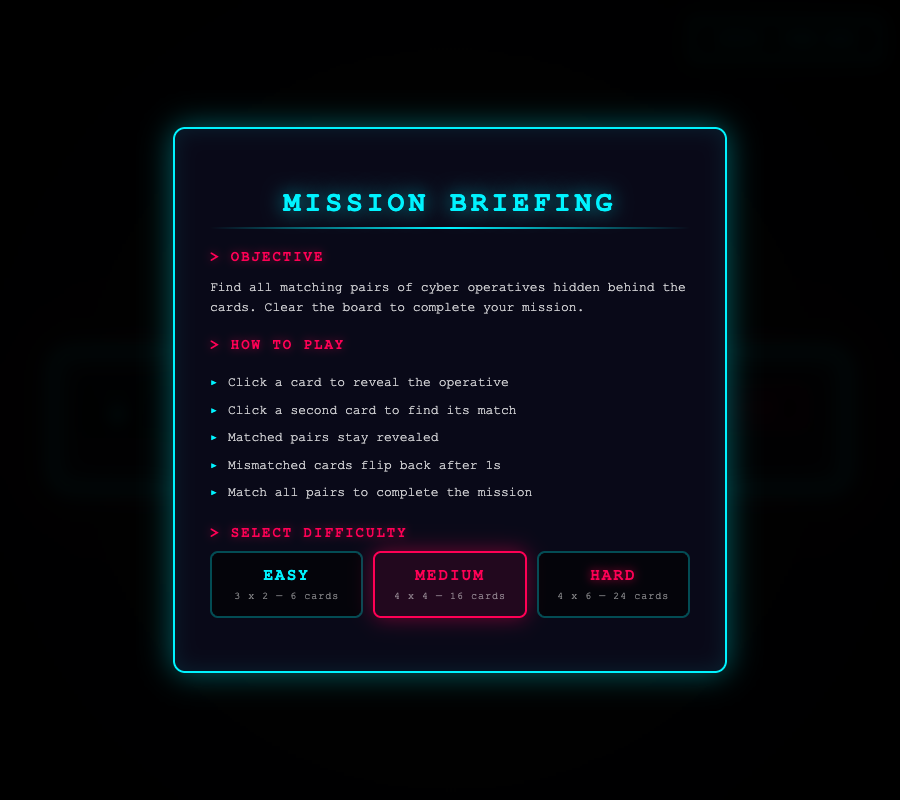
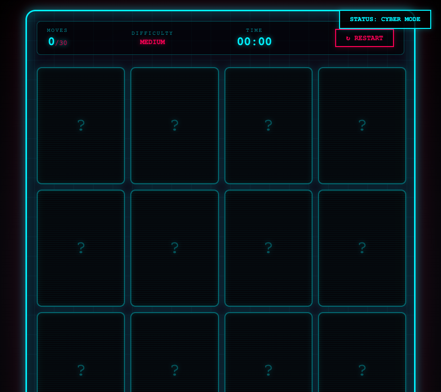
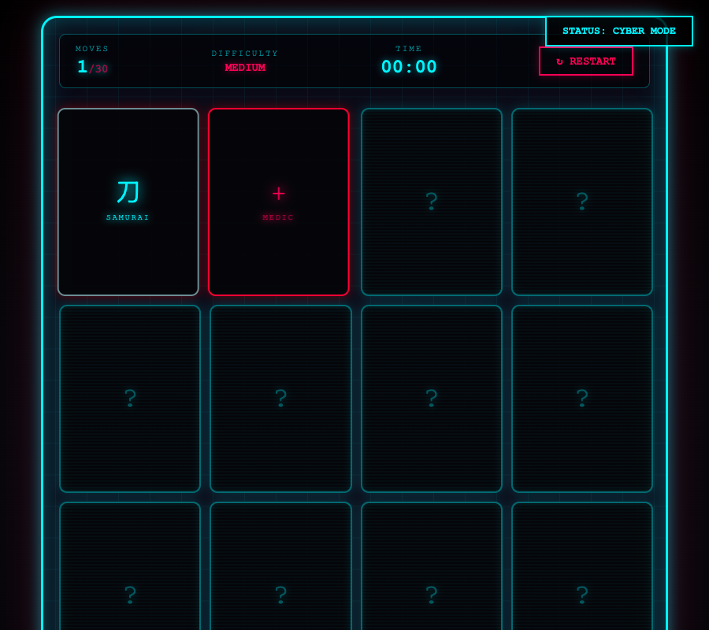
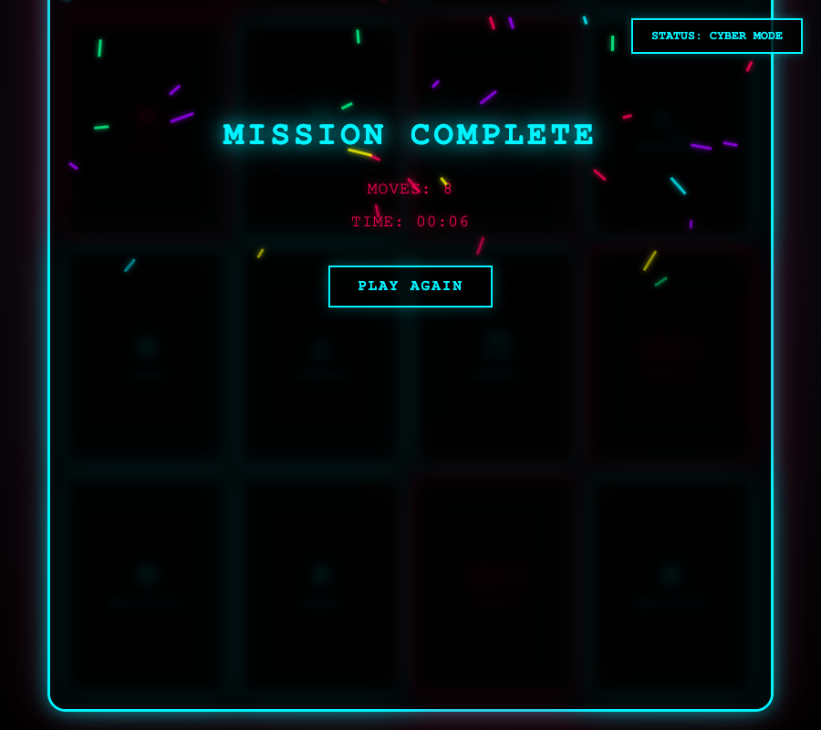
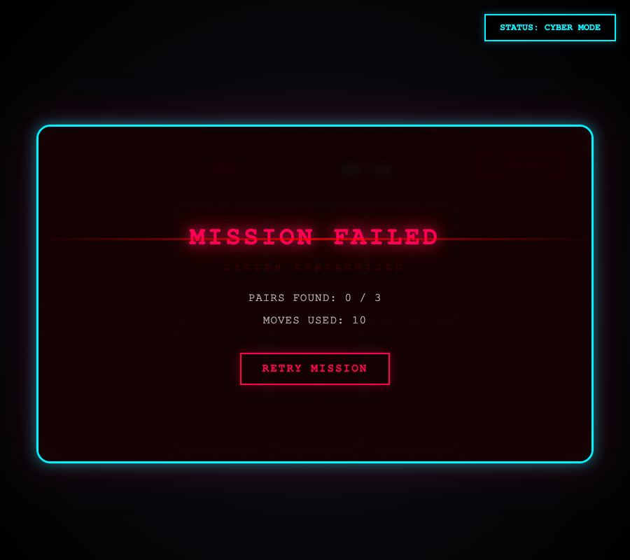

# Cyberpunk Memory Match

A cyberpunk-themed memory card game built with vanilla HTML, CSS, and JavaScript. Match pairs of sci-fi operatives before running out of moves.
👉 **  https://laddtnov.github.io/cyberpunk-memory-match/**

## Tech Stack


**[Live Demo]( https://laddtnov.github.io/cyberpunk-memory-match/)** | 📁 **[Source Code]( https://laddtnov.github.io/cyberpunk-memory-match/)**

- **HTML5** — Semantic markup, data attributes
- **CSS3** — 3D transforms, keyframe animations, Grid layout, `backdrop-filter`
- **JavaScript (ES6+)** — DOM manipulation, game state management, Fisher-Yates shuffle

## Screenshots

| Mission Briefing | Game Board |
|:---:|:---:|
|  |  |

| Gameplay | Mission Complete |
|:---:|:---:|
|  |  |

| Mission Failed |
|:---:|
|  |

## Features

- **3 Difficulty Levels** — Easy (3x2), Medium (4x4), Hard (6x4)
- **Move Limit** — Limited moves per difficulty adds strategic pressure
- **Card Flip Animation** — CSS 3D `rotateY` with `preserve-3d`
- **8 Sci-Fi Characters** — NETRUNNER, ANDROID, MECH PILOT, GHOST, SAMURAI, MEDIC, SNIPER, VIRUS (+ 4 more on Hard)
- **Win Effects** — Neon particle rain, scanline sweep, glitch title animation
- **Lose Effects** — Red glitch overlay, blinking "SYSTEM COMPROMISED", static scanlines
- **Mission Briefing** — Rules modal on first load with difficulty selector
- **HUD** — Moves counter with limit, timer, difficulty display, restart
- **Cyber Mode / Safe Mode** — Toggle to disable animations for accessibility
- **Responsive** — Works on desktop, tablet, and mobile
- **Reduced Motion** — Respects `prefers-reduced-motion`

## How to Play

1. Select a difficulty level from the Mission Briefing screen
2. Click cards to reveal hidden cyber operatives
3. Find matching pairs before running out of moves
4. Match all pairs to complete the mission

## Roadmap

- [ ] Online multiplayer mode
- [ ] Leaderboard with high scores
- [ ] Sound effects and ambient audio

## Run Locally

Open `index.html` in a browser, or serve with any static server:

```bash
python3 -m http.server 8080
```

## License

MIT
